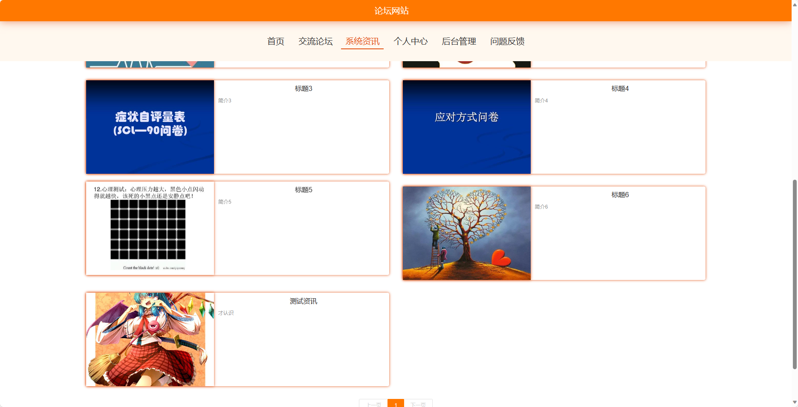

基于SpringBoot的论坛网站（程序+论文）
=
- 完整代码获取地址：从戎源码网 ([https://armycodes.com/](https://armycodes.com/))
- 作者微信：19941326836  QQ：952045282 
- 承接计算机毕业设计、Java毕业设计、Python毕业设计、深度学习、机器学习
- 选题+开题报告+任务书+程序定制+安装调试+论文+答辩ppt 一条龙服务

一、项目介绍
---
基于Spring Boot框架实现的论坛网站，系统包含两种角色：管理员、用户,系统分为前台和后台两大模块，主要功能如下。
### 【前台】：
首页：展示论坛网站的主页，包括热门帖子、最新资讯等信息。
交流论坛：用户可以在交流论坛中发帖、回帖，与其他用户进行讨论和交流。
系统资讯：展示论坛网站的最新资讯。
个人中心：用户可以在个人中心查看和编辑个人信息，包括头像、昵称、个人简介等。
问题反馈：用户可以向管理员反馈问题。

### 【后台】：
### 【管理员】：
个人中心：管理员可以在个人中心查看和编辑个人信息。
用户管理：管理员可以管理用户，包括查看用户列表、编辑用户信息、删除用户等操作。
普通管理员管理：管理员可以管理普通管理员，包括添加新的普通管理员、编辑管理员信息、删除管理员等操作。
论坛类别管理：管理员可以管理论坛的类别，包括添加新的类别、编辑类别信息、删除类别等操作。
交流论坛管理：管理员可以管理交流论坛，包括置顶、删除、编辑帖子、屏蔽用户等操作。
系统管理：管理员可以管理系统设置。

### 【用户】：

个人中心：用户可以在个人中心查看和编辑个人信息。
用户管理：用户可以管理自己的账号，包括查看个人信息、编辑个人信息、修改密码等操作。
电影类型管理：用户可以管理电影的类型，包括添加新的类型、编辑类型信息、删除类型等操作。
电影信息管理：用户可以管理电影的信息，包括添加新的电影、编辑电影信息、删除电影等操作。
留言板管理：用户可以管理留言板，包括查看留言、回复留言等操作。
论坛交流：用户可以在论坛中发帖、回帖。
系统管理：用户可以管理系统设置。

### 【普通管理员】：
个人中心：普通管理员可以在个人中心查看和编辑个人信息。
交流论坛管理：普通管理员可以管理交流论坛，包括置顶、删除、编辑帖子等操作。

二、项目技术
---
- 编程语言：Java
- 数据库：MySQL
- 项目管理工具：Maven
- 前端技术：VUE、HTML、Jquery、Bootstrap
- 后端技术：Spring、SpringMVC、MyBatis

三、运行环境
---
- 操作系统：Windows、macOS都可以
- JDK版本：JDK1.8以上都可以
- 开发工具：IDEA、Ecplise、Myecplise都可以
- 数据库: MySQL5.7以上都可以
- Tomcat：任意版本都可以
- Maven：任意版本都可以

四、运行截图
---
### 论文截图：

### 程序截图：

